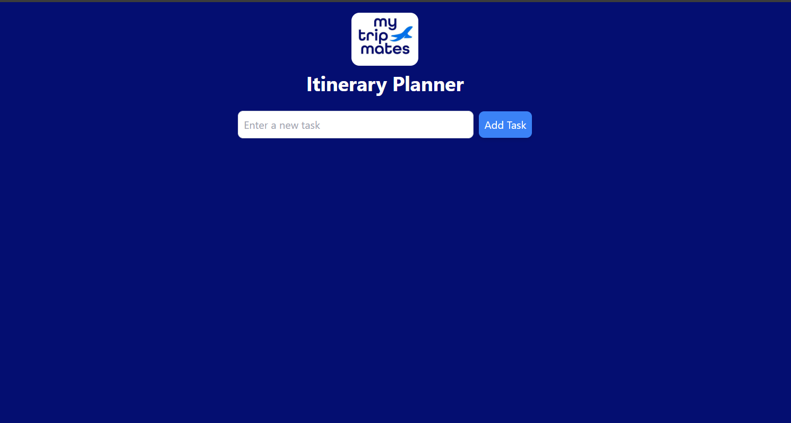
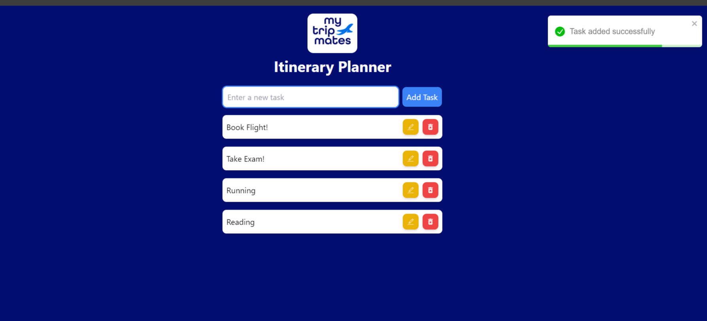
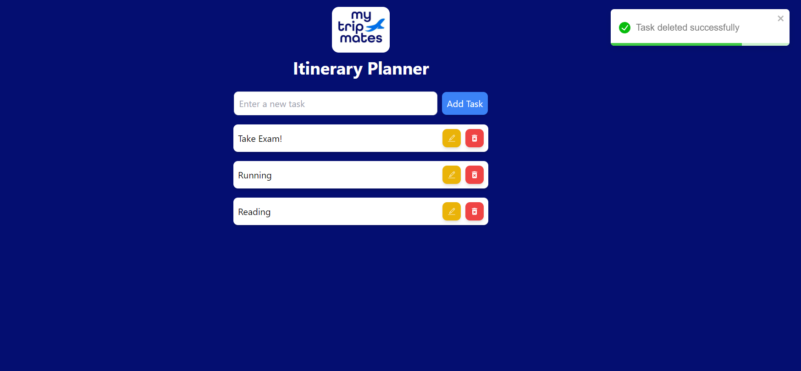
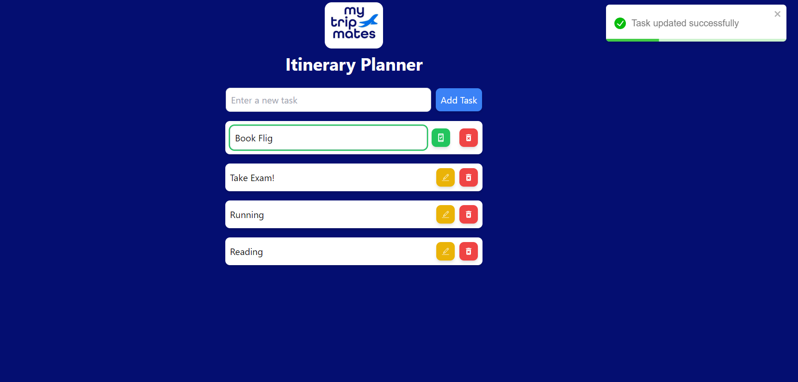
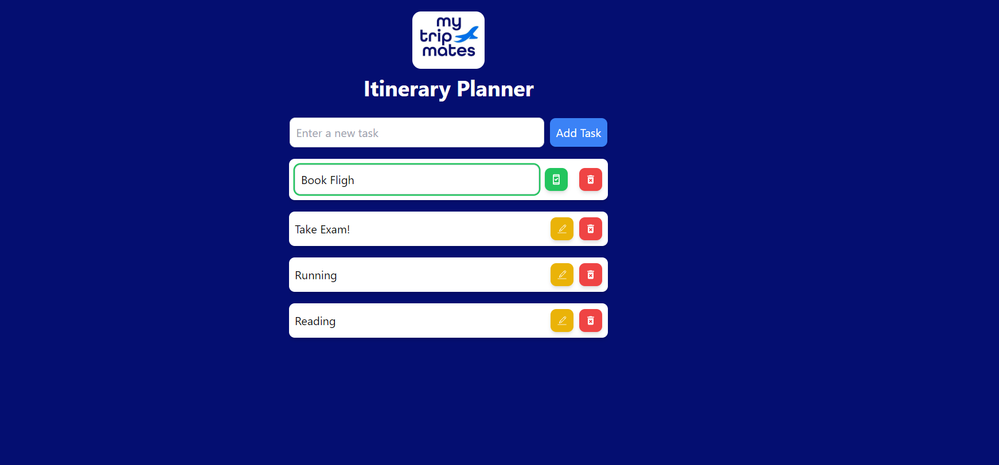

# mtm-frontend-Akarsh Singh
# Itinerary Planner

The Itinerary Planner is a simple React application designed for managing travel tasks. Users can add, view, update, and delete tasks, demonstrating familiarity with CRUD operations in React using hooks.

## Features

- **Add Tasks**: Users can enter tasks into an input field and add them to their itinerary.
- **View Tasks**: Display all tasks in a list.
- **Update Tasks**: Users can edit the text of tasks in their list.
- **Delete Tasks**: Users can remove tasks from their list.
- **Overflow Handling**: Tasks with long descriptions have a horizontal scrollbar.

## Technical Requirements

- **React Hooks**: Implemented using functional components with hooks such as `useState`.
- **CRUD Operations**: Full support for Create, Read, Update, and Delete operations for tasks.
- **Input Validation**: Prevents empty task submissions.
- **Styling**: Utilizes Tailwind CSS for styling.

## Installation

1. **Clone the repository:**
   git clone 
   cd mtm-frontend-yourname
2. **Install Dependencies:**
    npm install
3. **Run the Application**
    npm start

## Project Structure
1. src/components/TaskInput.js: Handles adding new tasks.
2. src/components/TaskList.js: Displays, updates, and deletes tasks.
3. src/App.js: Main component that ties everything together.
4. src/index.css: Contains Tailwind CSS for styling.

